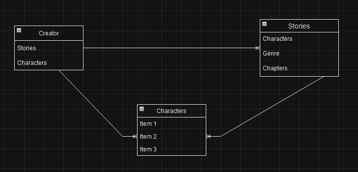

# OC_Collection

## Goal

For this project I am attempting to have an app that stores the data and images of my and my friends' OCs(Original Characters). 

## Process

- Create Models for creators, characters and stories
- Seed data for every model
- Style a front end that allows a user to read data
- Link to any available story chapters
- Include a gallery for each character available

## CRUD
- Create an OC
- Reading the frontend
- Update stories, bios, and galleries for characters as needed
- Delete obsolete data that won't be needed if a character is scrapped

## Stretch Goals
- Refactor into react
- Add in a carousel for when the story nav gets too long
- Have home page of popular characters be based off of site traffic
- Add characters to story page 
- Allow search for stories by genre